# Software Architecture — Donations API v1

**Version:** 1.2.0 | **Stack:** Kotlin 2.2 · Spring Boot 4.0.5 · PostgreSQL 18.3

---

## Table of Contents

1. [Overview](#1-overview)
2. [Network Architecture](#2-network-architecture)
3. [Component Architecture](#3-component-architecture)
4. [Domain Model (Classes)](#4-domain-model-classes)
5. [Database Architecture](#5-database-architecture)
6. [Data Flows](#6-data-flows)
7. [Security and Access Control](#7-security-and-access-control)
8. [Interaction Flows (Sequence)](#8-interaction-flows-sequence)
9. [Package Structure](#9-package-structure)

---

## 1. Overview

The application is a **REST API** for church financial management. It manages donors, donations, expenses, and generates financial reports. It exposes protected endpoints secured with session-based authentication and role-based access control.

```
┌─────────────────────────────────────────────────────────┐
│                    Clients                              │
│          (Browser / Mobile / Postman)                   │
└──────────────────────┬──────────────────────────────────┘
                       │ HTTPS  :8081
                       ▼
┌─────────────────────────────────────────────────────────┐
│              Donations API (Spring Boot)                │
│  ┌──────────┐  ┌──────────┐  ┌──────────┐  ┌────────┐   │
│  │   Auth   │  │  Users   │  │ Donors / │  │Reports │   │
│  │Controller│  │Controller│  │Donations │  │        │   │
│  └──────────┘  └──────────┘  │ Expenses │  └────────┘   │
│                              └──────────┘               │
└──────────────────────┬──────────────────────────────────┘
                       │ JDBC :5432
                       ▼
┌─────────────────────────────────────────────────────────┐
│              PostgreSQL 18.3 (Docker)                   │
│         Database: donations                             │
└─────────────────────────────────────────────────────────┘
```

---

## 2. Network Architecture

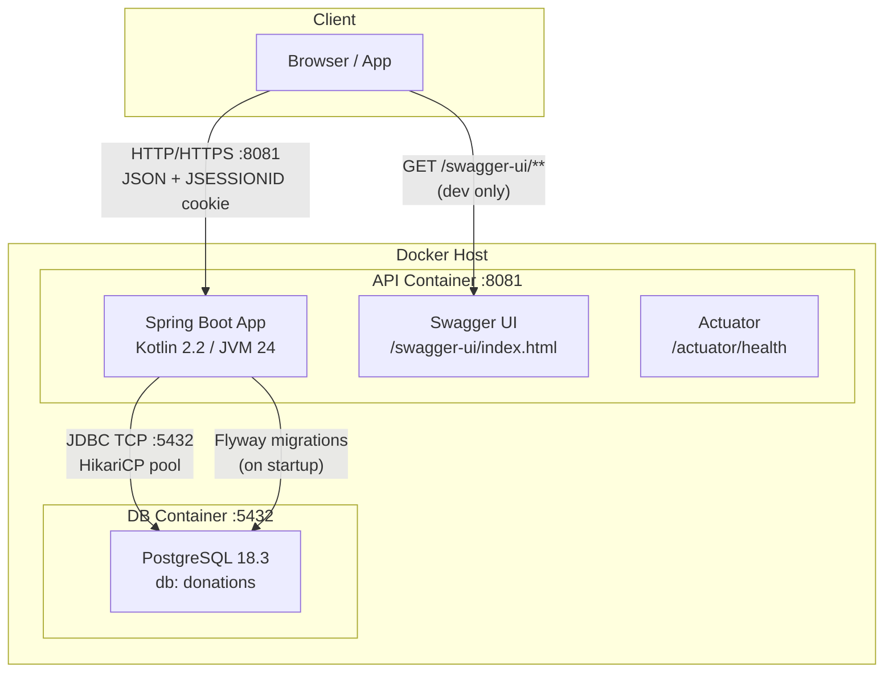

### Ports and Protocols

| Service | Port | Protocol | Access |
|---------|------|----------|--------|
| REST API | 8081 | HTTP (→ HTTPS in prod) | Public (auth required) |
| Swagger UI | 8081 | HTTP | `dev` profile only |
| Actuator health | 8081 | HTTP | Public |
| PostgreSQL | 5432 | TCP / JDBC | Internal only |

### Environment Variables (production)

```bash
SPRING_DATASOURCE_URL=jdbc:postgresql://host:5432/donations
SPRING_DATASOURCE_USERNAME=donations
SPRING_DATASOURCE_PASSWORD=***
APP_CORS_ALLOWED_ORIGINS=https://my-frontend.com
SPRING_PROFILES_ACTIVE=prod   # disables Swagger
```

---

## 3. Component Architecture

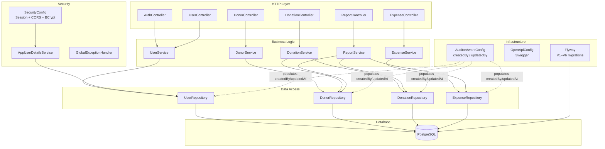

### Layer Responsibilities

| Layer | Classes | Responsibility |
|-------|---------|----------------|
| **Controllers** | `*Controller` | Receive HTTP, validate input, delegate to service, map response |
| **Services** | `*Service` | Business logic, transactions, domain rules |
| **Repositories** | `*Repository` | SQL queries via Spring Data JPA |
| **Entities** | `User`, `Donor`, `Donation`, `Expense` | Persisted domain model |
| **DTOs** | `*Request`, `*Response` | API contracts (input/output) |
| **Security** | `SecurityConfig`, `AppUserDetailsService` | Authentication, authorization, sessions |
| **Infrastructure** | `GlobalExceptionHandler`, `AuditorAwareConfig` | Cross-cutting concerns: errors, auditing |

---

## 4. Domain Model (Classes)

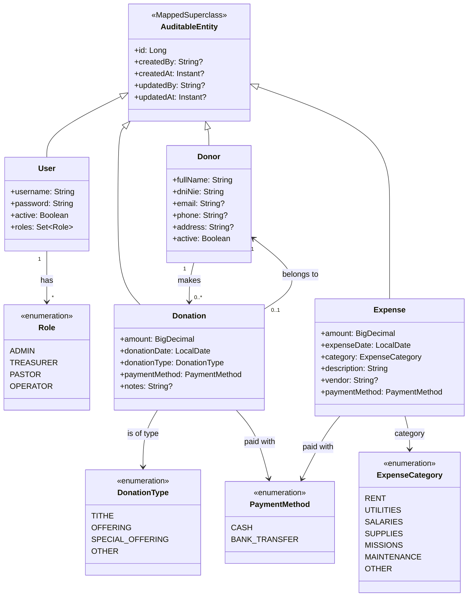

---

## 5. Database Architecture

### Entity-Relationship Diagram

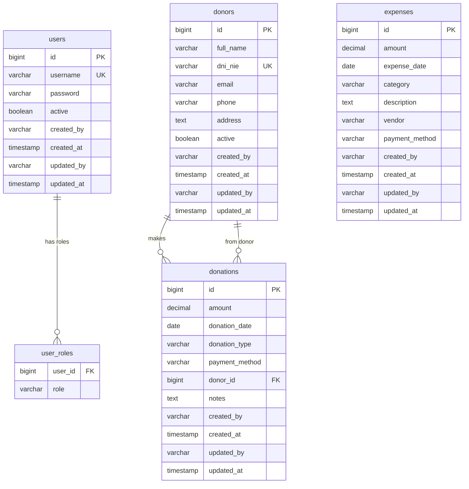

### Indexes and Constraints

| Table | Column | Type |
|-------|--------|------|
| `users` | `username` | UNIQUE |
| `donors` | `dni_nie` | UNIQUE |
| `donations` | `donation_date` | INDEX |
| `donations` | `donor_id` | INDEX + FK → donors |
| `user_roles` | `(user_id, role)` | PRIMARY KEY |

### Flyway Migrations

```
V1__create_schema_baseline.sql   → empty baseline
V2__create_users_and_roles.sql   → users + user_roles tables
V3__seed_admin_user.sql          → default admin user (BCrypt)
V4__create_donors.sql            → donors table
V5__create_donations.sql         → donations table + indexes
V6__create_expenses.sql          → expenses table + index
```

---

## 6. Data Flows

### General HTTP Request Flow

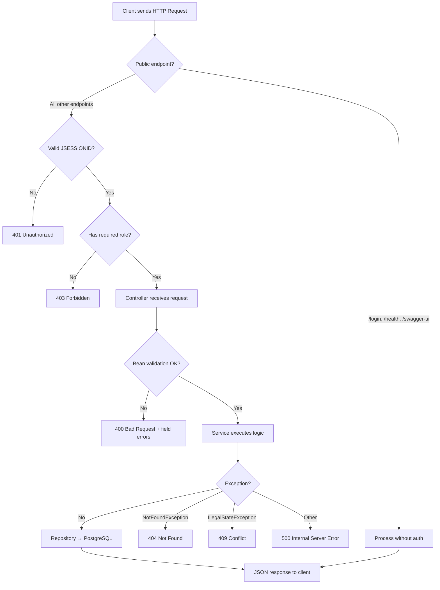

### Donation Flow with Duplicate Detection

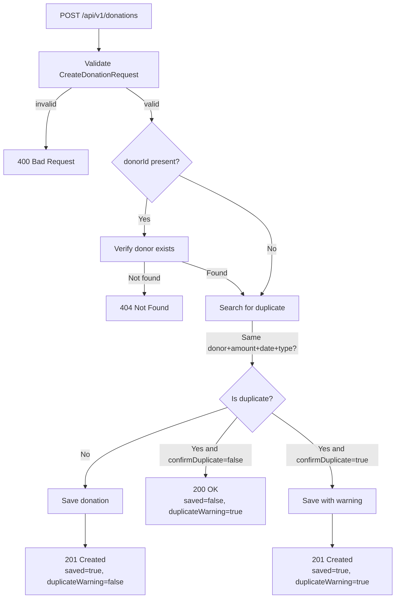

### Balance Report Flow

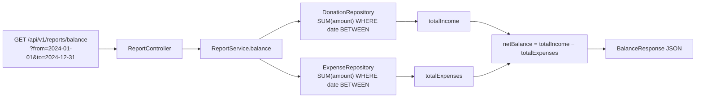

---

## 7. Security and Access Control

### Role Model

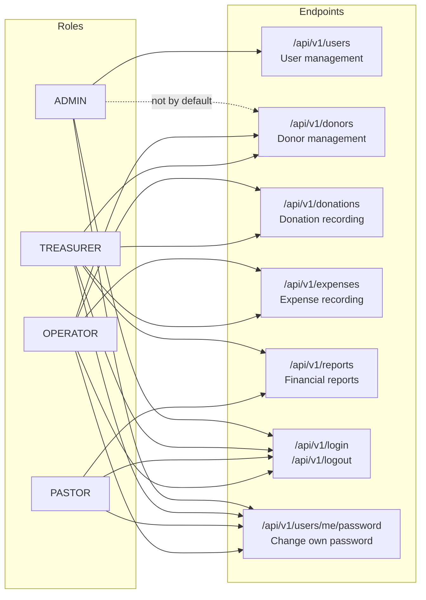

### Authentication Mechanism

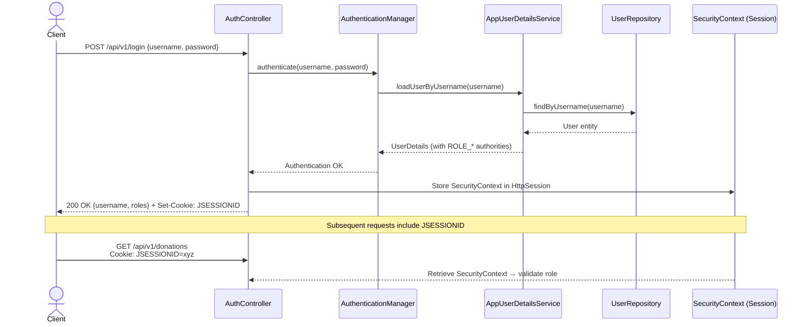

---

## 8. Interaction Flows (Sequence)

### Create Donor

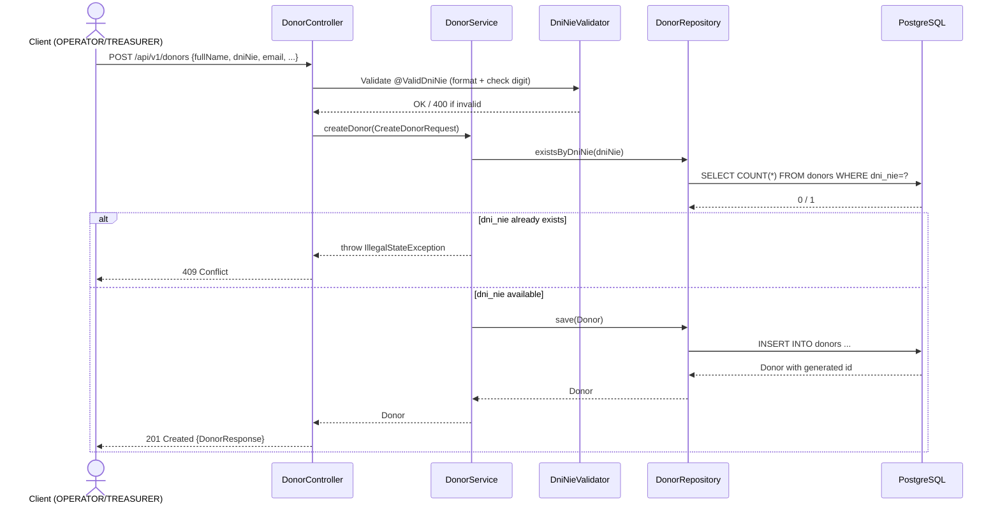

### Generate Donation Report by Type

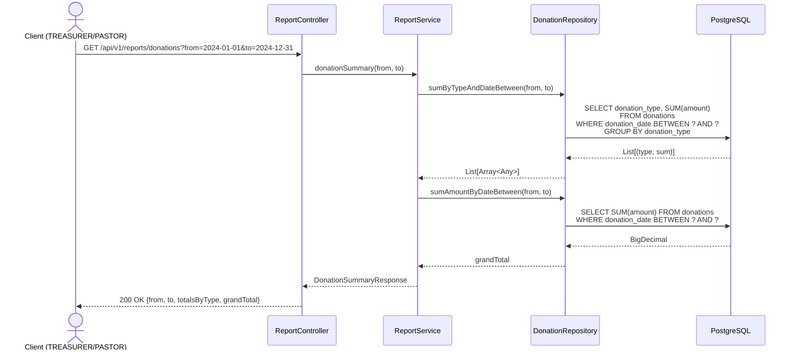

### Change Own Password

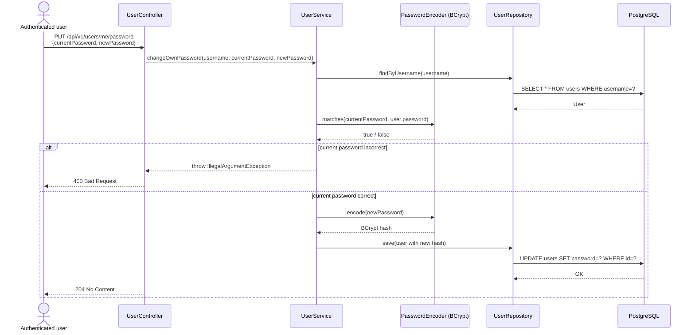

---

## 9. Package Structure

```
com.donations/
│
├── DonationsApplication.kt              ← Entry point
│
├── user/                                ← Domain: Users
│   ├── User.kt                          Entity
│   ├── Role.kt                          Enum
│   ├── UserRepository.kt               JPA Repository
│   ├── UserService.kt                  Service (CRUD + passwords)
│   ├── UserController.kt               REST Controller
│   ├── UserDtos.kt                     Request / Response DTOs
│   ├── AuthController.kt               Login endpoint
│   └── AppUserDetailsService.kt        Spring Security bridge
│
├── donor/                               ← Domain: Donors
│   ├── Donor.kt                         Entity
│   ├── DonorRepository.kt              JPA Repository
│   ├── DonorService.kt                 Service
│   ├── DonorController.kt              REST Controller
│   ├── DonorDtos.kt                    DTOs
│   └── validation/
│       ├── ValidDniNie.kt              Annotation
│       └── DniNieValidator.kt          DNI/NIE logic (modulo 23)
│
├── donation/                            ← Domain: Donations
│   ├── Donation.kt                      Entity
│   ├── DonationType.kt                 Enum
│   ├── PaymentMethod.kt                Enum (shared with Expense)
│   ├── DonationRepository.kt           JPA + @Query aggregations
│   ├── DonationService.kt             Service (duplicate detection)
│   ├── DonationController.kt           REST Controller
│   └── DonationDtos.kt                DTOs (incl. DonationCreateResponse)
│
├── expense/                             ← Domain: Expenses
│   ├── Expense.kt                       Entity
│   ├── ExpenseCategory.kt              Enum
│   ├── ExpenseRepository.kt            JPA + @Query aggregations
│   ├── ExpenseService.kt               Service
│   ├── ExpenseController.kt            REST Controller
│   └── ExpenseDtos.kt                 DTOs
│
├── report/                              ← Domain: Reports
│   ├── ReportService.kt               Service (read-only, no own entity)
│   ├── ReportController.kt             REST Controller
│   └── ReportDtos.kt                  Response DTOs
│
└── infrastructure/
    ├── config/
    │   ├── SecurityConfig.kt           Auth, CORS, sessions, BCrypt
    │   └── OpenApiConfig.kt            Swagger / OpenAPI 3
    ├── audit/
    │   ├── AuditableEntity.kt          Base entity (id + audit fields)
    │   └── AuditorAwareConfig.kt       Reads SecurityContext → createdBy
    └── error/
        ├── GlobalExceptionHandler.kt   Centralized @RestControllerAdvice
        ├── NotFoundException.kt        Custom 404 exception
        └── ErrorResponse.kt           JSON error structure

src/main/resources/
├── application.yaml                     Config + dev/prod profiles
└── db/migration/
    ├── V1__create_schema_baseline.sql
    ├── V2__create_users_and_roles.sql
    ├── V3__seed_admin_user.sql
    ├── V4__create_donors.sql
    ├── V5__create_donations.sql
    └── V6__create_expenses.sql
```

---

## Design Decisions Summary

| Decision | Implementation | Reason |
|----------|---------------|--------|
| Authentication | HTTP session (JSESSIONID) | Simple for an API consumed by a single frontend |
| Authorization | `@PreAuthorize` per method | Granular, co-located with the endpoint |
| Auditing | `AuditableEntity` + `AuditorAwareConfig` | Traceability of who created/modified each record |
| Duplicates | Detection in `DonationService` + `confirmDuplicate` flag | Prevent double-entry errors without blocking the operator |
| DNI/NIE validation | Custom validator (modulo 23) | Requirement of the Spanish church context |
| Migrations | Flyway V1–V6 | Version-controlled schema, reproducible |
| Reports | `ReportService` with no own entity | Pure aggregations, no persisted state |
| Profiles | `dev` (CORS + Swagger) / `prod` (no Swagger) | Swagger not exposed in production |
